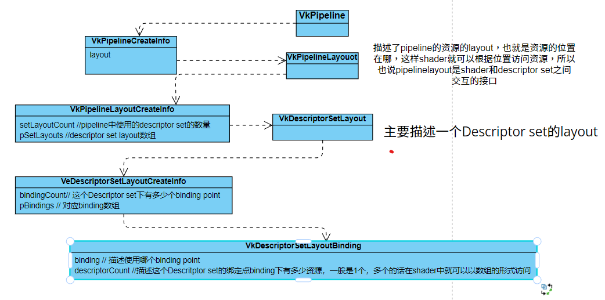

1. gLTF文件
	1. glTF™ (GL Transmission Format) is a royalty-free specification for the efficient transmission and loading of 3D scenes and models by applications. glTF minimizes both the size of 3D assets, and the runtime processing needed to unpack and use those assets. glTF defines an extensible, common publishing format for 3D content tools and services that streamlines authoring workflows and enables interoperable use of content across the industry.
	2. image buffer引用渲染模型需要的外部数据，image纹理，buffer几何/动画数据
	3. node引用了一个mesh/carmra，并且有一个局部坐标变换矩阵
	4. vertex skining，mesh上的顶点会受到骨骼的影响
	5. animation: 
		1. channels: index引用一个node标识作用动画的target，path是一个变换，标识对target做什么变换，变换的数据通过引用的smapler获得，sampler通过引用的两帧数据进行滚插值得到数据
		2. smapler:引用input and output data，分别为accesssor的索引，accessor对应的数据为前后两帧的数据，并且interplotation指定插值方式
		
# 作业框架相关
1. logical device 被抽象成VulkanDevice，并且创建它时，query出logical device需要支持的队列簇的indices(例如graphics，compute，transfer队列簇)，并创建VkQueueCreateInfo，在创建Device时
    1. 将queueCreateInfo传递给DeviceCreateinfo,
	2. 将需要支持的extension传递给DeviceCreateInfo，
	3. 将device需要支持的Feature告诉DeviceCreateInfo
	3. 标识要创建的队列需要以及创建commandBufferPool，并且它的usage bit为reset，也就是commandBuffer可以进行重用，

2. RenderCompleteSemaphore:用于同步present操作，因为需要先render结束之后才能present，所以它结束之后semaphore调用V操作，此时present阶段才能进行展示颜色
3. PresentCompleteSemphore:用于同步vkAcquireNextImage，因为需要先将image渲染完成之后present之后他才能被acquire出来，然而vkAcquireNextImage调用会直接返回，若返回的nextImage index还没有被present，这时之后的vkQueueSubmit提交一个绘制命令绘制到这个acquire出来的图像上，那就会出错，因为它上一帧的图像还没有被呈现出来
4. VulkanExampelBase::vulkanDevice是一个逻辑设备，在创建它时创建了一个commandPool,作为vulkanDevice的成员，但是VulkanExampel子类，在prepare时，也创建了一个commandPool，这是为何？
5. 由于模型的vertices和vertexIndices数据不会改变，所以也使用staging buffer将它们copy到GPU local emory
6. 创建descriptor set时创建descriptor set layout，并且创建pipelineLayout，并且创建pipeline

# 作业记录
1. 修改VulkanglTFModel::Node结构，添加index用于之后递归根据索引查找对应Node，因为tinyglft中对于每个animation channel中指定的是Node的的索引，而VulkanglTFModel::Node是以树状结构组织Node的，无法直接通过索引获得对应Node， 修改loadNode函数签名，添加传入参数nodeIndex，以在加载Node是设置它在全局nodes中对应的索引
2. 添加nodeFromIndex函数用于DSF查找Node
3. 添加加载Animation函数
4. TODO 配置Joint信息
5. 学习清除如何创建animation信息的descriptor set，并在合适的位置将其发送到GPU
6. gltf配置每个顶点最多受4个joints的影响
7. VkDrawIndex()因为之前已将所有vertex和vertexIndices传到GPUbuffer中，所以对于不同的mesh primitive只需要指定这个primitive的顶顶点在indices中的起始位置，以及数量，就能绘制出这个primitive。

# 骨骼动画
1. 配置command buffer，在每次绘制一个node->mesh之前，1号binding point上使用Descriptor set描述fk matrix
2. 解释
    ```C++
	
	struct AnimationChannel {
		uint32_t samplerIndex;
		std::string path;
		Node* node;
	};
	
	struct AnimationSampler {
		std::string interpolation;
		std::vector<float> inputs;  //key frames
		std::vector<glm::vec4> outputs;  //transformation data of corresponding key frames
	};
	
	struct Animation {
		std::string name;
		std::vector<AnimationChannel> channels;
		std::vector<AnimationSampler> samplers;
		float                         start = std::numeric_limits<float>::max();
		float                         end = std::numeric_limits<float>::min();
		float                         currentTime = 0.0f;
	};
	```
	通过当前时间找到前后两个key frame i，j
	目标骨骼为 AnimationChannel::Node* node;
	fk变化为 outputs i，j之间进行插值(根据channel::path指定的变化translation，rotation，scale)
3. 宏观描述：
    1. shader中传入所有node的transformation (node就代表了骨骼，由一个mesh即多个三角形组成)
	2. 配置顶点属性时，添加一项nodeIndex，来说明每一个个顶点属于哪一个骨骼,如下图，相同的颜色代表统一个node
    
	3. 在shader中通过nodeIndex获取对应的transformation matrix，来进行变换
4. 直接updateAnimation，它会更新每个node的局部transformation，然后resetCommand重新构建命令，它会使用vkCmdPushConstant将model传递给GPU，问题就是每帧都得重建commandBuffer，直接将所有全局transformation传递到ssbo，然后每帧只需要CPU端计算然后memcpy到GPU即可
# PBR
1. 材质直接push constant到GPU中，因为在渲染过程中不会改变
2. light的信息和场景信息通过uniform 每帧更新
3. 需要将多个采样器传送给pipeline, 用来作为漫反射、法线等贴图
4. 对于当前模型gltf模型中的matiral中最多有5个贴图
  1. albedoMap;
  2. normalMap;
  3. aoMap;
  4. metallicRoughnessMap
  5. emissiveMap;

    应该创建5中不同的sampler，descriptor set1中创建5个binding point，每当绘制一个primitive时就绑定这个primitive对应的5binding point
5. 修改loadgltf函数，加载描述材质的其余贴图
6. test shader首先设置固定roughness 和 metallic参数，使用PBR算法得到结果
    
    原始Blinn-phong
    
    只添加normal map
    


# PBR学习

​	 As physically based rendering aims to mimic light in a physically plausible way, it generally looks more realistic compared to our original lighting algorithms like Phong and Blinn-Phong. Not only does it look better, as it closely approximates actual physics, we (and especially the artists) can author surface materials based on physical parameters without having to resort to cheap hacks and tweaks to make the lighting look right. One of the bigger advantages of authoring materials based on physical parameters is that these materials will look correct regardless of lighting conditions;

 1. 目标

     1. 如何通过normal mapping计算出新的法线，TBN是什么？
         	2. gamma correction
         	3. HDR

 2. microfacets：极小的完全镜面反射，粗糙度与镜面的法线集中程度有关，**达到的效果**就是对于光的反射程度，是更分散地反射，还是集中的反射到同一个方向，具体如何描述集中程度呢？就是看法线与L和V的half vector的接近程度

 3. 能量守恒：

    1. 区分specular reflection和diffuse reflection

       原因光打到物体表面有两个去向，反射部分和折射部分，反射部分构成了specular reflection，而折射部分就是进入物体表面，假设光束进入物体表面后光子和物体内的粒子进行碰撞，有的光子能量被吸收，转化为热量，有的光子被随机向任意反弹出来(认为反弹出的位置和入射位置距离非常近)，反弹出来的就被观察为diffuse reflection

    2. 区分metallic材质和dielectric材质，metallic材质认为光的折射部分能量就直接被吸收了，不会被反弹出来，所以对外表现为只有specular reflection，dielectric材质两者都有

    3. 折射反射的部分的能量是互斥的，使用fresnel定律计算出用于反射能量的比例Ks，就能得到用于折射的能量比例Kd=1-Ks

 4. 作为渲染方程中的一项BRDF是任意的，但是并不是所有都是基于物理的，blinn-phong中漫反射和高光就是直接指定了反射系数，相当于BRDF，但是它没考虑能量的问题

 5. Cook-Torrance BRDF：基于物理的BRDF
    $$
    f_r=k_d f_{lambert}+k_sf_{cook−torrance}
    $$

    1. 其中kd，ks分别为用于折射和反射能量的比例

    2. diffuse reflection的BRDF $f_{lambert} = \frac{c}{\pi}$

    3. specular reflection的BRDF
       $$
       f_{CookTorrance}=\frac{DFG}{4(ωo⋅n)(ωi⋅n)}
       $$

       1. D: 法线分布函数，Trowbridge-Reitz GGX

          ```glsl
          float DistributionGGX(vec3 N, vec3 H, float a)
          {
              float a2     = a*a;
              float NdotH  = max(dot(N, H), 0.0);
              float NdotH2 = NdotH*NdotH;
          	
              float nom    = a2;
              float denom  = (NdotH2 * (a2 - 1.0) + 1.0);
              denom        = PI * denom * denom;
          	
              return nom / denom;
          }
          ```

          

       2. F: 菲涅尔项，描述反射能量Fresnel-Schlick approximation

          ```glsl
          vec3 fresnelSchlick(float cosTheta, vec3 F0)
          {
              //cosTheta = dot(normal, halfway vector);
              //F0 = vec3(0.04),金属和非金属的折射率分界大约为1.5->计算出来的基础反射率就是0.04
              //F0 = mix(F0, surface.baseColor.rgb, metallic)通过将基础反射率与表面颜色按金属度进行混合，计算出表面在法向量垂直于视线方向时的反射率，而金属度值指示了表面材质是否为金属或非金属。这个值越高，表明材质越金属,此时使用表面颜色作为反射率是比较合理的
              return F0 + (1.0 - F0) * pow(1.0 - cosTheta, 5.0);
          }
          ```

          

          1. 相关概念

             基础反射率（Base Reflectivity），又称为法线反射率（Normal Reflectance），是指在**入射角为0度时，表面所反射的光线的比例。**在计算渲染中，它通常用F0表示，是一个RGB值，描述了不同波长下入射角为0度时的反射率。对于金属等导体表面，基础反射率通常较高，且会因为金属的属性而带有色彩；而对于介质表面，基础反射率通常较低，且不带有色彩。在渲染中，基础反射率是物理材质模型中一个重要的参数，用于计算表面的反射光线，影响最终的图像效果。

       3. G: 自遮挡函数，Smith's Schlick-GGX 

          ```glsl
          float GeometrySchlickGGX(float NdotV, float k)
          {
              float nom   = NdotV;
              float denom = NdotV * (1.0 - k) + k;
          	
              return nom / denom;
          }
            
          float GeometrySmith(vec3 N, vec3 V, vec3 L, float k)
          {
              float NdotV = max(dot(N, V), 0.0);
              float NdotL = max(dot(N, L), 0.0);
              float ggx1 = GeometrySchlickGGX(NdotV, k);
              float ggx2 = GeometrySchlickGGX(NdotL, k);
          	
              return ggx1 * ggx2;
          }
          ```

 6. **环境光遮蔽**指的是在三维场景中，由于光线的散射和物体之间的遮挡关系，导致物体表面某些区域接收到的光线比其他区域少，从而产生阴影的效果。在PBR中，环境光遮蔽可以作为一种额外的贴图输入，用于在渲染时调整表面的遮挡强度，进一步增加物体表面的真实感和细节。

    **微表面的自遮挡**指的是微表面上的几何细节（例如微小的凹坑、起伏等），会导致光线被反射、折射和散射，从而在观察者和光源之间产生遮挡的效果。在PBR中，微表面的子遮挡通常通过几何遮挡函数（Geometric Shadowing Function）和分布函数（Distribution Function）来计算。它们是PBR模型中的两个关键部分，用于模拟光在物体表面上的反射、折射和散射等过程，从而更加准确地渲染真实世界中的光影效果。

 7. HDR

    显示器被限制为只能显示值为0.0到1.0间的颜色，但是在光照方程中却没有这个限制，所以会将超过1.0的颜色全部clamp到1.0，会使得高色域的颜色缺少区分度。通过使片段的颜色超过1.0，我们有了一个更大的颜色范围，这也被称作**HDR(High Dynamic Range, 高动态范围)**。有了HDR，亮的东西可以变得非常亮，暗的东西可以变得非常暗，而且充满细节。

8. Tone mapping
   1. 这些色调映射算法经常会包含一个选择性倾向黑暗或者明亮区域的参数，叫做曝光度。
   2. HDR图片包含在不同曝光等级的细节, 通过设置曝光参数允许我们更加精确设定我们是要注重黑暗还是明亮的区域的HDR颜色值。举例来说，高曝光值会使隧道的黑暗部分显示更多的细节，然而低曝光值会显著减少黑暗区域的细节，但允许我们看到更多明亮区域的细节。

9. IBL（image based lighting）主要是**处理间接光照**

     1. Image based lighting使用environment map，其中shading point采样到的每一个texel都认为是环境光打到这个点的radiance，而不是光源的radiance，因此就是认为光源是无限远的，map上存储的是该shading point上应该接收到的能量，就没有距离什么事。而对于直接光照计算时，一般给定的是光源的positon，color(能量)，因此渲染方程中的Li(wi, p) = I / (r^2)

     2. 其光源不是如[前一节教程](https://learnopengl-cn.github.io/07 PBR/02 Lighting/)中描述的可分解的直接光源，而是将周围环境整体视为一个大光源。IBL 通常使用（取自现实世界或从3D场景生成的）环境立方体贴图 (Cubemap) ，我们可以将立方体贴图的每个像素视为光源，在渲染方程中直接使用它。这种方式可以有效地捕捉环境的全局光照和氛围，使物体**更好地融入**其环境。

     $$
     L_o(\mathbf{p}, \omega_o) = \int_\Omega f_r(\mathbf{p}, \omega_i, \omega_o) 
     L_i(\mathbf{p}, \omega_i) (\omega_i \cdot \mathbf{n}) d\omega_i \\\\
     f_r=k_d f_{lambert}+k_sf_{cook−torrance}\\\\
     f_{CookTorrance}=\frac{DFG}{4(ωo⋅n)(ωi⋅n)}
     $$


     1. 对于**直接光照**计算**反射方程**时：

        1. 直接采样光源就可以，没有积分需要计算，它的BRDF包括diffuse reflection 和 specular reflection，先求kd，ks，以及f cook-torrance, 进而得到 BRDF项fr，然后直接fr * 光源能量 * cos θ就得到了从wo方向观察p点，直接光照所贡献的亮度(有多个光源时，求和即可，这里说的时点光源或方向光源，打到一个点的只有该光源发出的一条射线)

     2. 对于**间接光照**计算反射方程时：使用IBL。

        1. 取自现实世界或从3D场景生成的环境立方体贴图 (Cubemap)，将立方体贴图的每个像素视为间接光的入射能量Li(p, wi)项)，在渲染方程中直接使用它

        2. 对于一个点p，计算出它在一个半球面内每一条光线，对于出射方向wo的radiance的贡献也就时反射方程中的积分，求解积分我们可以离散处理，使用蒙特卡洛积分，计算出Lo

           计算中BRDF也包括两项，diffuse reflection 和 specular reflection(**其中反射能量比例ks包含在了F菲涅尔项中了**)
           $$
           L_o(\mathbf{p}, \omega_o) = k_d \cdot \frac{c}{\pi}\int_\Omega 
           L_i(\mathbf{p}, \omega_i) (\omega_i \cdot \mathbf{n}) d\omega_i + \int_\Omega f_r(\mathbf{p}, \omega_i, \omega_o) 
           L_i(\mathbf{p}, \omega_i) (\omega_i \cdot \mathbf{n}) d\omega_i
           $$

           1. **漫反射部分的积分值**，运行时对于整个任意半球面进行积分，开销很大，可以根据环境光贴图，预先生成一个**irradianceMap**贴图，它表示环境中的**一个点p的微小区域**，法线为n，接收到的irradiance是多少，iradiance贴图就相当于一个函数，输入法线，输出是这个区域接收到的irradiance，生成的irradiance如图

              

              ```glsl
              vec3 irradiance = texture(irradianceMap, N).rgb;//接收到的irradiance
              vec3 fr = albedo / pi; //漫反射的brdf是常数
              vec3 Lo = kd * fr * irradiance; //该点p，从整个半球方向接收到能量，然后反射到wo方向的能量是多少
              ```
           
           2. 高光反射部分，使用split sum方法将，积分拆开
              $$
              \int_\Omega f_r(\mathbf{p}, \omega_i, \omega_o) 
              L_i(\mathbf{p}, \omega_i) (\omega_i \cdot \mathbf{n}) d\omega_i \approx \int_{\Omega}L_i(\omega_i \cdot \mathbf{n}) d\omega_i \cdot  \int_{\Omega}f_r(\mathbf{p}, \omega_i, \omega_o)(\omega_i \cdot \mathbf{n})  d \omega_i \\
               \int_{\Omega}f_r(\mathbf{p}, \omega_i, \omega_o)(\omega_i \cdot \mathbf{n})  d \ \approx R_0 \int_{\Omega} \frac{f_r}{F}(1-{cos\theta_i}^5) cos\theta_i d \omega_i +\int_{\Omega} \frac{f_r}{F}(1-{cos\theta_i}^5) cos\theta_i d \omega_i \\
               其中第二部分的拆分是使用 Schilck's approximation，来进行
              $$
           
              1. 第一项计算出来存储为一个**prefilteredColorMap**里面，是三通道的贴图，输入: 1.法线n  2. roughness， 三个元素的向量代表颜色
              2. 第二项计算出来存储在一个**brdfLUTMap**里面，输入 1. 法线 2. 观察方向 输出 :  r通道：公式(2)的第一项，g通道：公式(2)的第二项

 10. 


# TODO

	1. 本来想参考 example/pbrtexutre实现PBR的间接光照，需要添加天空盒作为环境光照， 它里面使用VulkanglTFModel.h中的功能，但是我包含的时候，stb_image报错，可能时CMake配置问题。之后再熟悉vulkan时再做
	1. 文档整理
