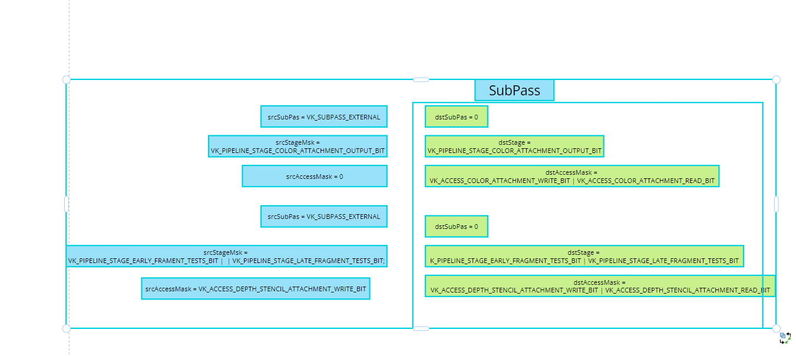
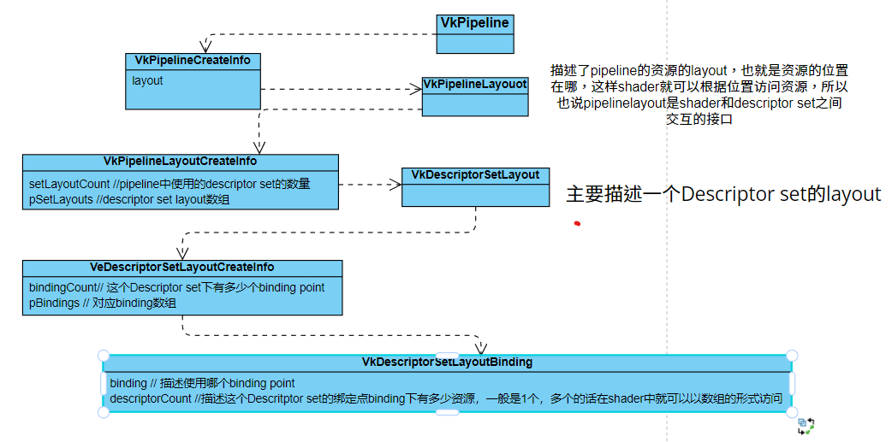

# 1. 概念以及使用

1. vk对象创建方法：

   1. 对象的描述VkObjectCreateInfo
   2. 创建vkCreateObject

2. 带有内存的对象创建

   1. 对象的描述VkObjectCreateInfo
   2. vkCreateBuffer(): VkBuffer句柄
   3. 获取内存要求：vkGetBufferMemoryRequirement(): Requirement句柄
   4. 分配内存：vkAllocateMemory(): VkDeviceMemory句柄
   5. 内存与Buffer句柄的绑定 vkBindBufferMemory()

3. subpass+attachmet

   ​	Vulkan中的**subpass使用VkAttachmentReference来引用attachment**。**每个subpass都会使用一组attachment来进行渲染**，并通过VkAttachmentReference结构体来指定subpass中使用的attachment的索引和使用方式。这些attachment的定义是在渲染流程中的VkRenderPass对象中进行的，而**subpass则指定了哪些attachment用于该子渲染过程以及如何使用它们**。这种设计**允许我们在不同的子渲染过程中重用相同的attachment**(attachmentRef引用的的同一些attachment)，从而提高了渲染效率。

4. 一个图像的布局表示该图像在内存中的存储方式和使用方式，`不同的布局可以影响 GPU 在读取和写入图像数据时的性能和行为。

5. command pool创建时

6. 在 Vulkan 中，每个图像都必须被指定一个特定的布局，这个布局定义了图像可以用于哪些操作，并决定了图像数据在内存中的组织方式。例如，`VK_IMAGE_LAYOUT_UNDEFINED` 表示图像数据在第一次使用前没有被定义，`VK_IMAGE_LAYOUT_GENERAL` 表示图像可以被用于任何操作，`VK_IMAGE_LAYOUT_COLOR_ATTACHMENT_OPTIMAL` 表示图像用于颜色附件，等等。

   在执行 `vkCmdCopyBufferToImage` 命令之前，需要确保目标图像已经被转换为可用于复制的布局。这是因为 `vkCmdCopyBufferToImage` 命令会将缓冲区中的数据复制到图像的指定区域。如果目标图像的布局不正确，可能会导致数据不正确或者出现未定义行为。

   因此，在调用 `vkCmdCopyBufferToImage` 之前，需要调用 `vkCmdPipelineBarrier` 命令，将目标图像的布局从未定义的布局转换为适合作为复制目标的布局。这可以通过将 `VK_IMAGE_LAYOUT_UNDEFINED` 布局转换为 `VK_IMAGE_LAYOUT_TRANSFER_DST_OPTIMAL` 来实现，从而指示图像将被用作传输目标。

11. aspect 是指图像的一个方面，如颜色、深度或模板等。aspectMask 参数用于指定要操作的图像方面，例如 VK_IMAGE_ASPECT_COLOR_BIT 表示操作颜色方面，VK_IMAGE_ASPECT_DEPTH_BIT 表示操作深度方面，VK_IMAGE_ASPECT_STENCIL_BIT 表示操作模板方面

    aspectMask 参数通常在创建 ImageView 和进行 Barrier 操作时使用，以指定对哪个方面进行操作。

12. 描述旧布局和新布局之间的**资源访问控制**，srcAccessMask, dstAccessMask指定了不同的布局之下，资源的访问方式，例如将image的layout从VK_IMAGE_LAYOUT_UNDEFINED转换为VK_IMAGE_LAYOUT_TRANSFER_DST_BIT，说明oldlayout的访问控制是无，**newlayout的访问控制是允许作为传输目标进行写**

    ```c++
    srcAccessMask = 0;
    dstAccessMask = VK_TRANSFER_WRITE_BIT;
    ```

9. Vulkan中的pipeline由多个stage组成，每个stage都有特定的功能和目的，下面是一个完整的pipeline中的所有stage（按照执行顺序排列）：

   1. VK_PIPELINE_STAGE_TOP_OF_PIPE_BIT：表示pipeline开始执行的阶段，通常用于同步操作等待所有前置操作完成；
   2. VK_PIPELINE_STAGE_DRAW_INDIRECT_BIT：表示处理绘制间接命令的阶段；
   3. VK_PIPELINE_STAGE_VERTEX_INPUT_BIT：表示顶点数据输入阶段；
   4. VK_PIPELINE_STAGE_VERTEX_SHADER_BIT：表示顶点着色器执行阶段；
   5. VK_PIPELINE_STAGE_TESSELLATION_CONTROL_SHADER_BIT：表示镶嵌细分控制着色器执行阶段；
   6. VK_PIPELINE_STAGE_TESSELLATION_EVALUATION_SHADER_BIT：表示镶嵌细分评估着色器执行阶段；
   7. VK_PIPELINE_STAGE_GEOMETRY_SHADER_BIT：表示几何着色器执行阶段；
   8. VK_PIPELINE_STAGE_FRAGMENT_SHADER_BIT：表示片段着色器执行阶段；
   9. VK_PIPELINE_STAGE_EARLY_FRAGMENT_TESTS_BIT：表示执行深度/模板测试的阶段；
   10. VK_PIPELINE_STAGE_LATE_FRAGMENT_TESTS_BIT：表示执行深度/模板测试的阶段；
   11. VK_PIPELINE_STAGE_COLOR_ATTACHMENT_OUTPUT_BIT：表示执行颜色混合和写入操作的阶段；
   12. VK_PIPELINE_STAGE_COMPUTE_SHADER_BIT：表示计算着色器执行阶段；
   13. VK_PIPELINE_STAGE_BOTTOM_OF_PIPE_BIT：表示pipeline完成执行的阶段，通常用于同步操作等待所有后续操作完成。

   注意，上述stage不是全部都会在一个pipeline中使用，而是根据需要选择合适的stage组合。例如，一个简单的graphics pipeline通常只需要使用前面的几个stage，而不需要使用计算着色器和最后的bottom-of-pipe阶段。

# 资源和内存

1. accessMask 表示了缓冲区的**内存访问类型**，主语是**缓冲区内存*，宾语是**被访问**

2. 只有当缓冲区(包括VkBuffer，VkImage)的**使用方式发生改变**时，才需要设置内存屏障

3. 创建VkImage时指定的usage

   ```C++
   VkSwapchainCreateInfoKHR createInfo{};
   createInfo.imageUsage = VK_IMAGE_USAGE_COLOR_ATTACHMENT_BIT; //说明该图像能过作为渲染图像(就是帧缓冲中的color attachment)
   
   VkImageCreateInfo depthImageCI{};
   depthImageCI.usage = VK_IMAGE_USAGE_DEPTH_STENCIL_ATTACHMENT_BIT; //说明该图像能过作为深度图(就是帧缓冲中的depth attachment)
   
   //创建FrameBuffer时，指定的attachment, 再创建render pass时就可以创建两个attachmentDescription，分别描述两个渲染目标，color attachment和depth attachment
   std::array< VkImageView, 2> attachments = { swapChainImageViews[i], depthImageView };
   ```

   

https://zhuanlan.zhihu.com/p/617374058

   1. A render pass **represent a collection of** attachements , subpasses , and dependencies between the subpasses and **describes how the attachements are used** over the course of subpasses. The use of a render pass in a command buffer is a render pass instance
   2. Renderpass object会和VkFrameBuffer object配合使用，framebuffer代表一系列即将用作attachement的images的集合，这些attachment将会在renderpass中使用到。
   3. render pass 中指定的 attachment 对应着 framebuffer 中的 attachment。在 Vulkan 中，渲染操作是在一个特定的 render pass 中进行的，而 render pass 描述了渲染操作期间 framebuffer 中的 attachment 被如何使用。当创建一个 render pass 时，需要指定所有要用到的 attachments 的格式、加载行为、存储行为、初始图像布局和最终图像布局等信息。在渲染操作执行期间，Vulkan 会根据 render pass 中的描述将指定的数据渲染到 framebuffer 中的对应 attachment 上。因此，当创建 render pass 和 framebuffer 时，需要确保它们中指定的 attachment 对应正确，否则渲染结果可能会出错。
   4. **X**: framebuffer 中是一组attachments的集合，创建renderPass时，首先需要`VkAttachmentDescription`，它就是描述renderPass将要使用的frambuffer中的Attacnment的格式、加载行为、存储行为、初始图像布局和最终图像布局等信息。`VkAttachmentReference`用于指定subpass使用哪个attachment，以及这个subpass中layout如何，这里面的`VkAttachmentDescription`数组以及`VkAttachmentReference`指向的attachment都要和framebuffer中绑定的ImageView顺序相同
   5. https://zhuanlan.zhihu.com/p/450157594 他的vertex description和descriptor 的讲解
   6. 当要使用多个render pass时，就需要另外创建framebuffer，指定其使用的attachment，然后将frambuffer与render绑定
   7. 在 Vulkan 中，Subpass dependencies 和 Pipeline Barriers 都可以用于进行资源布局转换。它们的主要区别在于作用的粒度和调用的方式。

      Subpass dependencies 用于指定子渲染过程之间的依赖关系，包括输入、输出、采样器和附件等资源的读写顺序和访问模式。每个子渲染过程可以使用不同的帧缓冲，并且有自己的颜色、深度和模板附件，它们的初始布局、最终布局和转换方式可以在 Subpass dependencies 中指定。Subpass dependencies 的优点是可以在子渲染过程之间建立依赖关系，提高渲染效率和灵活性。

      Pipeline Barriers 则用于指定在当前渲染过程中执行的操作，例如在渲染管线中切换渲染目标、进行资源布局转换、同步访问和数据复制等。Pipeline Barriers 的调用方式比 Subpass dependencies 更灵活，可以在任意时刻插入并指定所需的资源、操作和访问模式等参数。

      总的来说，Subpass dependencies 适用于需要在不同子渲染过程之间建立依赖关系的情况，而 Pipeline Barriers 则适用于在当前渲染过程中进行布局转换、同步访问和数据复制等操作的情况。使用哪种方式取决于具体的应用场景和需求。
   8. **TODO:** subPass、subPassDependence、布局转换

      

# Descriptor Set


1. vulkan接口和sprv-v之间的数据映射方法：

   1. input attributes: 

   2. vk只能创建vertex shader stage的输入属性，首先需要VkPipelineVertexInputStateCreateInfo填充VkVertexInputAttributeDescription，之后再绘制之前，只需要绑定对应的vertex buffer以及indices buffer，就可以进行绘制

   3. Descriptors:

      A [resource descriptor](https://registry.khronos.org/vulkan/specs/1.3-extensions/html/vkspec.html#descriptorsets) is the core way to map data such as uniform buffers, storage buffers, samplers, etc. to any shader stage in Vulkan. One way to conceptualize a descriptor is by thinking of it as a pointer to memory that the shader can use.

   4. 在record command buffer时，进行draw call之前，vkCmdBindDescriptorSets来绑定本次draw callshader中会使用到的descriptor sets

   5. push constant：用于在每次record command buffer时更新一些频繁改变的、很小的数据块

   6. specialization constants： 相当于创建pipeline时指定的宏

   7. Physical Storage Buffer

2. DescriptorSetLayout 描述了 Shader 使用资源的布局，它主要包括了一个 binding 数组，数组中每项代表一个 Descriptor 信息，说明了这个 Descriptor 的类型、数量、对应的 Shader 阶段以及静态采样器列表。https://zhuanlan.zhihu.com/p/124251944

3. **Descriptor**是一个Descriptor set中的一项，他在一个集合中，如何来定位呢？就是使用**binding**，CPU端指定UBO为binding 0，texture sampler是binding 1，那么在GPU端的shader中，他就可以使用binding = 0/1，来拿到对应的资源。

# Pipeline

1. vertex input data processing

   1. 顶点输入数据的描述主要两部分

      1. `VkVertexInputBindingDescription bindings[]` 来描述app端传递给shader的顶点数据组织格式，比如直接对一个Vertex描述(它里面包含了所有顶点属性)

         ```c++
         struct Vertex{
          	glm::vec3 posiion;
             glm::vec2 uv;
         };
         Vectex vertices[1000];
         VkVertexInputBindingDescription binding = {
             0,                          // binding
             sizeof(Vertex),             // stride
             VK_VERTEX_INPUT_RATE_VERTEX // inputRate
         };
         ```

         如果数据是分散的，此时就需要两个binding

         ```C++
         glm::vec3 positons [1000]; 
         glm::vec2 uv[1000]，
         VkVertexInputBindingDescription bindings[2] = {
             {    0,                          // binding
             	sizeof(glm::vec3),             // stride
             	VK_VERTEX_INPUT_RATE_VERTEX // inputRate
             },
             {
                 0,                          // binding
          		sizeof(glm::vec2),             // stride
             	VK_VERTEX_INPUT_RATE_VERTEX // inputRate
             }
         };//positon 位于binding0， uv位于binding1
         ```

      2. 然后`VkVertexInputAttributeDescription attributes[]`描述了顶点binding中的**顶点属性**的描述，因为光知道顶点数据块还不行，还要描述它的组织格式，这样shader才能取出对应的**顶点属性**

         ```C++
         const VkVertexInputAttributeDescription attributes[] = {
             {
                 0,                          // location
                 binding.binding,            // binding
                 VK_FORMAT_R32G32B32_SFLOAT, // format
                 0                           // offset
             },
             {
                 1,                          // location
                 binding.binding,            // binding
                 VK_FORMAT_R8G8_UNORM,       // format
                 sizeof(glm::vec3)           // offset
             }
         };
         ```

         对应多个binding

         ```C++
         const VkVertexInputAttributeDescription attributes[] = {
             {
                 0,                          // location
                 binding[0].binding,            // binding
                 VK_FORMAT_R32G32B32_SFLOAT, // format
                 0                           // offset
             },
             {
                 1,                          // location
                 binding[1].binding,            // binding
                 VK_FORMAT_R8G8_UNORM,       // format
                 0				          // offset
             }
         };
         ```

         **此时需要更改offset，以及binding， 但是location不需要改变，vertex shader中顶点属性的访问只需要知道location即可，所以shader也不需要改变**

         **也就是说顶点的binding和loaction是相互独立的！shader只关心location，在app端，只要配置号location就行**

         ```glsl
         layout (location=0) inPosition;
         layout (location=1) inUV;
         ```

         

   2. 将顶点的bindingDescription和attributeDescription丢给VkPipelineVertexInputStateCreateInfo，用来在创建pipeline时来告诉它，顶点数据块有哪些，以及shader如何从中读取顶点属性

   3. pipeline layout

      

      

      1. descriptor set 描述a set of descriptor怎样布局
      2. 不同的pipeline需要一组不同的descriptor set，而这一组descriptor set如何布局就需要pipeline layout 来配置
      3. Push Constant可以让一种非常简单和有效的方式向着色器发送少量的数据(它有大小限制)。Push Constant可以向任何着色器阶段发送数据，并存储在CommandBuffer本身。Push Constant比UBO/SSBO快得多，但一个巨大的限制是数据的大小,规范要求Push Constant范围必须在128字节以内。

   4. pipeline barrirer同步资源的访问(其实是内存的依赖关系)，比如保证图像在被读取之 前数据被写入。它也可以被用来变换图像布局。

   5. pipeline创建流程


# command bufferhttps://zhuanlan.zhihu.com/p/620888071


1. Vulkan绘制使用命令模式，需要配置好**绘制需要的配置**、**资源**、以及相应的**绘制方式**，然后提交给VkQueue之后有GPU执行这些命令
   1. 绘制的配置就是所谓的 pipeline对象，创建pipeline时，其实就是配置这个绘制流程各个阶段的配置
   2. 资源包括：vertex buffer、index buffer、descriptor set
   3. 绘制方式：vkDraw、vkDrawIndexed
2. 

# 同步https://zhuanlan.zhihu.com/p/620888071

1. 从图中可以看出Semaphores主要用于Queue之间的同步工作，或在向单个Queue提交的粗粒度文件之间的同步工作(也就是GPU之中的同步)。而Fence用来同步Device和Hosts之间的工作，也就是CPU和GPU之间的同步。在VkSubmitInfo中看到了pWaitSemaphores以及pSignalSemaphores字段。pWaitSemaphores字段指定了这次Submit需要等待这些Semaphores发出信号之后才可执行。则pSignalSemaphores则制定了如果该批次完成了Command Buffer命令执行之后，则这些Semaphores发出信号。在这里主要通过Semaphores来显示控制Command Buffer的执行顺序。

# Queue

1. A “Queue Family” just describes a set of `VkQueue`s that have common properties and support the same functionality, as advertised in `VkQueueFamilyProperties`.创建logical device之前查询到需要的queueFamilyIndex，并指定数量配置成VkDeviceQueueCreateInfo，然后在创建logical device是填充deviceCreateInfo，对应的VkQueue会在创建logical device时创建出来，并在销毁logical device时被销毁，然后可以vkGetDeviceQueue从logical device中获取VkQueue


# GLSL

 	1. ubo与ssbo区别
 	 	1. UBO 的主要优势是能够更高效地与着色器进行交互，只读
 	 	2. ssbo可读可写

# GPU

1. shader core，小型的处理器，GPU片上主要时shader core，几千个
2. 掉用一次shader(如framgment shader)，就是一个thread，多个thread可以并行执行，因为它们的指令基本相同(除了分支)，所以可以使用SIMD，将多个threads作为一个warp，这个warp中的thread执行同样的指令，但是fetch不同的数据，这里如果有分支的话，多个thread覆盖不同的分支，那么该warp就要执行所有的分支中的指令，而一些不需要的分支的thread被迫执行，然后丢弃掉这期间计算的结果
3. 整个GPU实现，概念上上分为：
   1. geometry processing
   2. 
4. 硬件阶段逻辑抽象为logical pipeline，用来实现上面的概念分为：
   1. geometry processing
      1. vertex shader
      2. geometry shader
      3. tessellation shader
   2. rasterization
      1. Clipping
      2. Screen Mapping
      3. Triangle setup & Triangel traversal(就是光栅化，走像素)
   3. pixel processing
      1. fragment shader
      2. merger

5. 在图形渲染管线中，各个阶段的输入输出如下：

   1. 顶点输入阶段（Vertex Input Stage）：输入是顶点数据，包括顶点坐标、颜色、纹理坐标等信息。输出是一组顶点着色器输入变量（vertex shader input variables）。
   2. 顶点着色器阶段（Vertex Shader Stage）：输入是顶点着色器输入变量，输出是一组顶点着色器输出变量（vertex shader output variables）。
   3. 图元装配阶段（Primitive Assembly Stage）：输入是顶点着色器输出变量，将它们组合成几何图元，如点、线、三角形等。输出是一组几何图元。
   4. 几何着色器阶段（Geometry Shader Stage）：输入是几何图元，输出是一组顶点着色器输出变量，可以生成新的顶点、修改顶点的属性或是创建新的几何图元。
   5. 光栅化阶段（Rasterization Stage）：将几何图元转换成像素，输入是几何着色器输出变量，输出是一组片段着色器输入变量。
   6. 片段着色器阶段（Fragment Shader Stage）：输入是一组片段着色器输入变量，包括颜色、纹理坐标、深度等信息，输出是一组片段着色器输出变量（fragment shader output variables）。
   7. 像素操作阶段（Per-Sample Operations Stage）：根据像素的颜色、深度、模板值等进行多重采样、混合等操作，输出是最终的像素颜色和深度。
   8. 帧缓存输出阶段（Framebuffer Output Stage）：将处理后的像素数据输出到帧缓存中，包括颜色缓存、深度缓存、模板缓存等。

   在渲染管线中，每个阶段的输出都成为下一阶段的输入，而且每个阶段都是固定的，不能更改或省略。这种固定的流程可以高效地处理大量的渲染任务，并在硬件上进行优化。